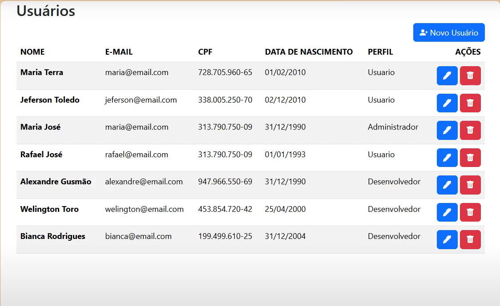

     
# Cadastro de Usuários - CRUD

Este é uma aplicação simples de cadastro de usuários. A conexão com o banco de dados foi feita utilizando
o XAMPP, a base de dados escolhida foi o SQL; a aplicação foi gerada com o Spring Initializr com as dependências:
- Spring Web
- Thymeleaf
- Validation
- Spring Data JPA
- MySQL Driver 

Foi utilizado o Kotlin no BackEnd, no FrontEnd foram utilizados além do Thymeleaf, o Bootstrap e o HTML.

🔗 [Assista ao vídeo no YouTube](https://youtu.be/ZK8flXVhos8) 

